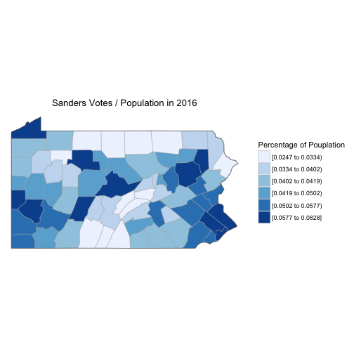

R Markdown and Reproducible Research Presentations
========================================================
author: Todd Suomela
date: November 4, 2016
autosize: true

Reproducible Research
======================================================

- A standard for publishing data and scientific analysis is that it be _reproducible_. In other words that other people can follow and re-create the data, software, and results of the research.
- The value of reproducible research is being accepted by a growing number of researchers.
- But the tools to carry out this research are still maturing.


What is Markdown?
========================================================

Markdown is a plain text file format designed to be easy-to-read and easy-to-write.  It was invented by John Gruber in the mid-2000s to make it easier for web writers to write text that could easily be converted into HTML.

"The overriding design goal for Markdown’s formatting syntax is to make it as readable as possible. The idea is that a Markdown-formatted document should be publishable as-is, as plain text, without looking like it’s been marked up with tags or formatting instructions. While Markdown’s syntax has been influenced by several existing text-to-HTML filters, the single biggest source of inspiration for Markdown’s syntax is the format of plain text email."

More detail about the Markdown project can be found at <https://daringfireball.net/projects/markdown/>

R and Markdown + Presentations
========================================================

R is a statistical language and programming environment that can be used for data analysis in a wide variety of fields.  More at <https://www.r-project.org/>

RStudio is an Integrated Development Environment for working in R.  More at <https://www.rstudio.com/>

R Markdown combines the Markdown formatting syntax with the R programming language in order to facilitate _literate programming_.

Markdown presentations use HTML5 and CSS to transform Markdown documents into slide presentations. For more details on authoring R presentations please visit <https://support.rstudio.com/hc/en-us/articles/200486468>.


A Rough Example - Primary Election Data
========================================================


```r
library(choroplethr)
library(choroplethrMaps)
library(dplyr)
data("county.regions")

pa.primaries <- read.csv("data/Pennsylvania Primary Results by County.csv", header = TRUE)
pa.primaries$county.name <- tolower(pa.primaries$County)

pa.counties <- filter(county.regions, state.name == "pennsylvania")

# Filtering the pa.primaries data frame to just the two Democrat candidates, plus renaming the columns.
pa.primaries.dem <- select(pa.primaries, county.name, sanders = Sanders_Bernie, clinton = Clinton_Hillary)
```

A Choropleth Map of Sanders Votes by County
========================================================


